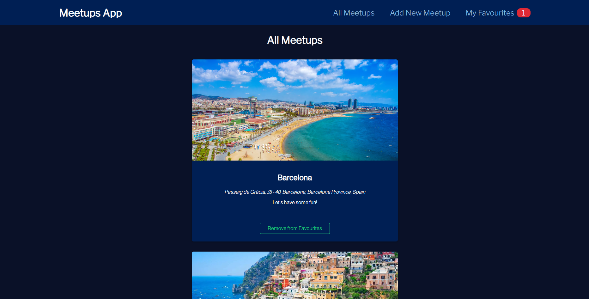
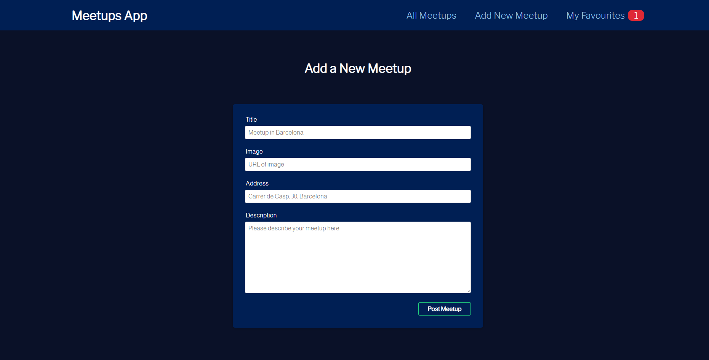
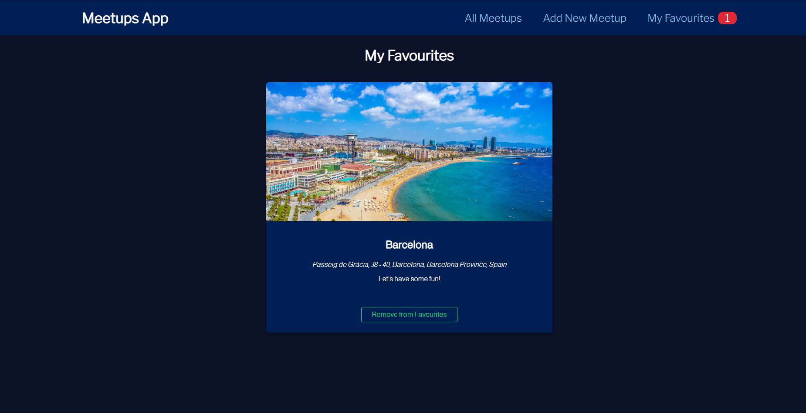

<a name="readme-top"></a>

<!-- PROJECT OVERVIEW -->
<br />
  <h3 align="center">Meetups App</h3>

  <p align="center">
    A very simple website where a user can view and add meetups as well as favourite them.
    <br/>
</div>


<!-- TABLE OF CONTENTS -->
<details>
  <summary>Table of Contents</summary>
  <ol>
    <li>
      <a href="#about-the-project">About The Project</a>
      <ul>
        <li><a href="#built-with">Built With</a></li>
      </ul>
    </li>
    <li><a href="#installation-and-usage">Installation and Usage</a></li>
    <li><a href="#what-i-learnt">What I Learnt</a></li>
  </ol>
</details>


<!-- ABOUT THE PROJECT -->
## About The Project
The all meetups page and root page of the website. The user can view the details of all meetups fetched from the database as well as add or remove them from their favourites list.



The Add New Meetups page where the user can fill out and submit a form to add a new meetup to the database.



The My Favourites page where a user can see a list of all their favourited meetups.




<p align="right">(<a href="#readme-top">back to top</a>)</p>


<!-- BUILT WITH -->
## Built With

* [![React][React]][React-url]
* [![React Router][React-router]][React-router-url]
* [![Vite][Vite]][Vite-url]
* [![Firebase][Firebase]][Firebase-url]
* [![CSS][CSS]][CSS-url]


<p align="right">(<a href="#readme-top">back to top</a>)</p>


<!-- Installation -->
## Installation and Usage

NOTE: As a prerequisite, you would need a version of [Node](https://nodejs.org/en) installed on your system to run the following commands.

1. Clone this repository onto your system using ``` git clone <repo link> ```
2. Open up your terminal and ``` cd ``` into the root of the cloned app directory
3. Run ``` npm i ``` inside the root directory to install all required dependencies
4. Run ``` npm run dev ``` inside the root directory to start the app, then navigate to the localhost url provided


<!-- WHAT I LEARNT -->
## What I Learnt

* Component Driven Design to create reusable components that can be used on different sections and pages of the website.
* Create 'wrapper' components that wrap around other elements to provide some kind of styling e.g. Card component in the UI folder.
* Third party library, React Router, to add routing so the user can navigate to different parts of the website.
* Build tool, Vite, to simplify and quicken the development experience with React.
* Third party API and Database, Firebase, to store and fetch meetups data and display on the frontend.
* React Context to prevent prop drilling and easily access state across the entire application.
* CSS modules, to seperate styling for each component so there are no clashes, whilst making the code more readable.


<!-- MARKDOWN LINKS -->
[React]: https://img.shields.io/badge/react-%2320232a.svg?style=for-the-badge&logo=react&logoColor=%2361DAFB
[React-url]: https://react.dev
[React-router]: https://img.shields.io/badge/React_Router-CA4245?style=for-the-badge&logo=react-router&logoColor=white
[React-router-url]: https://reactrouter.com/en/main
[Vite]: https://img.shields.io/badge/vite-%23646CFF.svg?style=for-the-badge&logo=vite&logoColor=white
[Vite-url]: https://vitejs.dev
[Firebase]: https://img.shields.io/badge/Firebase-039BE5?style=for-the-badge&logo=Firebase&logoColor=white
[Firebase-url]: https://firebase.google.com
[CSS]: https://img.shields.io/badge/css3-%231572B6.svg?style=for-the-badge&logo=css3&logoColor=white
[CSS-url]: https://www.w3.org/Style/CSS/Overview.en.html#:~:text=Cascading%20Style%20Sheets%20(CSS)%20is,CSS%20and%20on%20available%20software.
